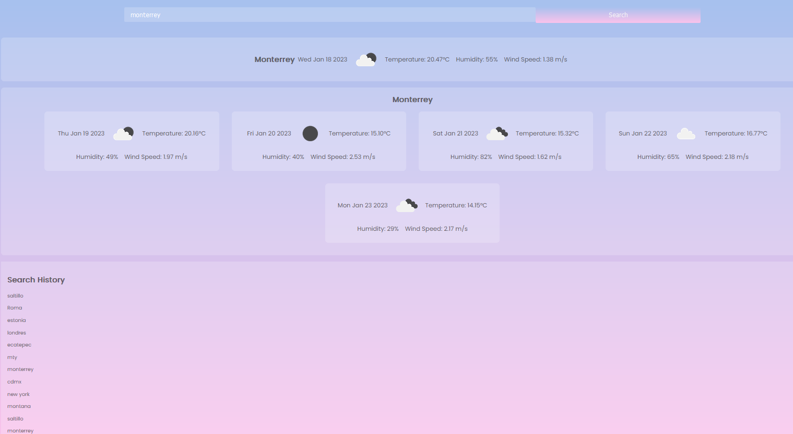

# Weather Forecast API

## Table of contents 🚀

* [Introduction](#introduction)
* [Requirements](#requirements)
* [How to use it](#how-to-use-it)
* [Feedback](#feedback)
* [Deployed links](#deployed-links)
* [Credits](#credits)

## Introduction

This weather dashboard is a dynamic and user-friendly web application that allows users to easily access current weather and forecast information for any city. The application uses OpenWeather API to fetch weather data and displays the weather, temperature, humidity, and wind speed for today and the next 5 days, as well as generating a search history to keep track of the cities searched. It's easy to use, simply enter the name of the city in the search bar, and the weather information will be displayed in a clear and visually appealing format. It's perfect for anyone who wants quick and easy access to weather information.

## Requirements

* Internet connection 🖥️

* A web browser (Google Chrome, Firefox, Safari, etc.) 🌍

* JavaScript enabled 🟨

## How to use it

1. Open the index.html file in your web browser.

2. In the search bar, enter the name of the city you want to know the weather information.

3. Click the "Search" button.

4. The current weather and forecast for today and the next 5 days for that city will be displayed.

5. The search history will also keep track of all cities searched.

6. Repeat the process for any other city you want to search.

## Feedback

We value your opinion and are constantly striving to improve our weather forecast webpage. If you have any feedback or suggestions on how we can enhance the user experience, please do not hesitate to share them with us. Your opinion is valuable to us and will help us to continue to provide the best service possible. If you have any questions or concerns, please feel free to contact us at contact@personal.openweather.com and we will be more than happy to assist you.

## Deployed links

* [Github Pages]()

* [Github Repository](https://github.com/Fabri-Tech?tab=repositories)

## Credits

[OpenWeather API](https://openweathermap.org/)

[Google Fonts](https://fonts.google.com/)